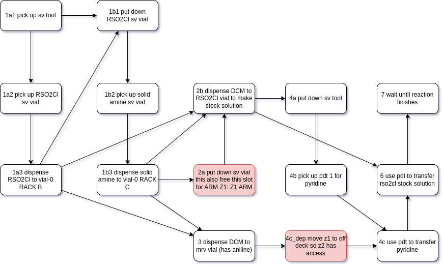

# ASPIRE Organic Lab Simulator

A simulation software for organic synthesis on an automated experimentation platform.

## Dependencies
- [`simpy`](https://simpy.readthedocs.io/): used for the actual DES
- [`casymda`](https://github.com/fladdimir/casymda): used for managing instruction dependencies

# Design

`hw.LabObject`: 
- any physical object except reaction-participating chemicals
- a state machine

`hw.Device`: a hw.LabObject that
- can, by receiving hw.Instruction, execute its action_methods to
- change its own state
- change other hw.LabObject instances’ states
- move simulation clock

An `action_method` is always implemented as two separate methods
- `PreActor(action_parameters)`
  - checks preconditions, error out if not met
  - make projections about the action
  - what hw.LabObjects will be occupied during this action?
  - how long will this action take?
- `PostActor(action_parameters)`
  - makes state transitions for all involved objects

`hw.Instruction`: 
- carries action_parameters 
- knows its preceding/succeeding hw.Instruction instances 
- lifecycle
  - when triggered, sends one request for each involved `hw.LabObject` instance
  - a request returns a place in the queue of that `hw.LabObject` (first come first serve)
  - once all requests are accepted, run the action’s PreActor
  - move the simulation clock
  - run the action’s PostActor
  - releases all occupied `hw.LabObject` instances
  - trigger succeeding hw.Instruction instances in its callbacks

# JUNIOR demo

A demo of N-Sulfonylation benchmark reaction can be accessed 
through this [temporary link](http://18.217.155.203:8000/).

The demo simulates the following instructions.

